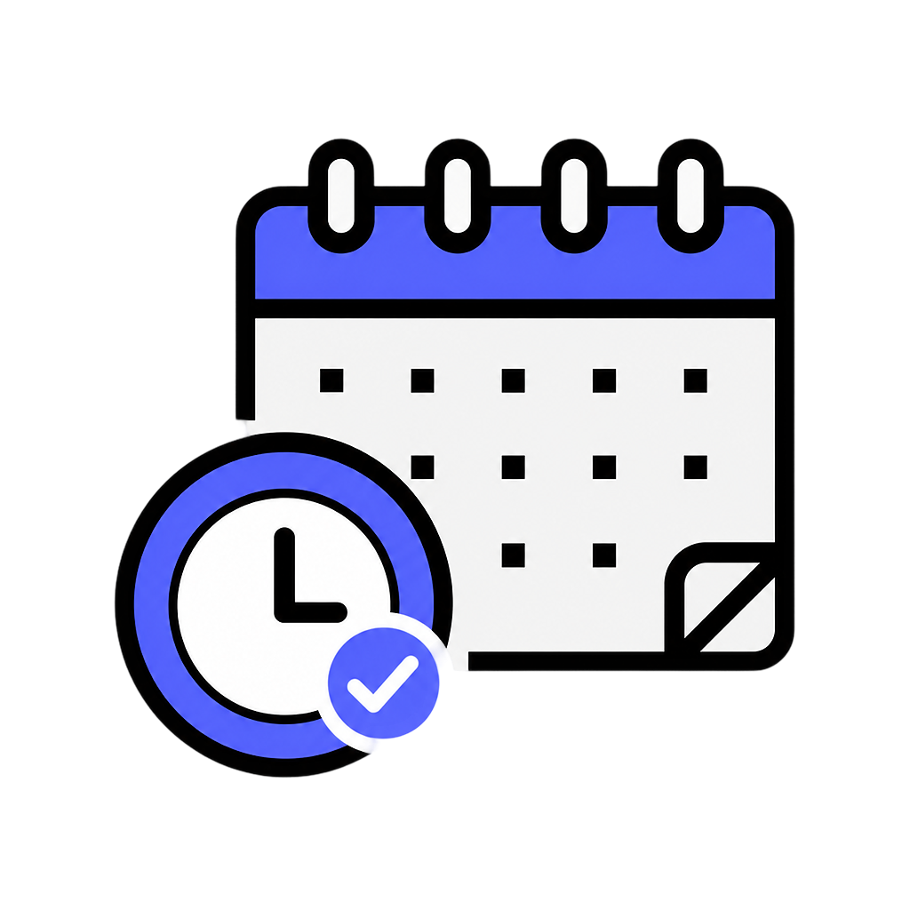

<h1 align="center">myAPT</h1>

<p align="center">
    
</p1>


<p align="center">
  
  
  
  
  
  
  
  
  
</p>

myAPT is an appointment scheduler web app, which can be used to book & manage appointments for ur business in the most easy and fastest way possible.
Just configure ur schedule and post it to your customers!

## Tech Stack

- **Backend:** Python, Flask
- **Database:** Firestore
- **Auth:** Firebase (Google OAuth)
- **Frontend:** HTML, CSS, JS

## What it does

Create an account and Sign in, set your available days and time ranges, pick slot durations and get a unique public booking link as simple as that. Share that link w anyone. They see only open slots to book. No account needed by customers. 

Your Dashboard updates you with a list of confirmed bookings.

## How it does 

**For the owner:**
1. Sign in with your google account.
2. Create a new booking page - Title, date ranges, slot durations daily.
3. Copy generated link and share with clients.
4. View all your schedulers and live bookings on dashboard.

**For the customer:**
1. Open the shared booking link, no login needed
2. Browse available slots.
3. Pick one - Fill your details, name, email, message
4. Slot Booked!

## Guide to Test Locally

Install the dependencies:

```
pip install flask firebase-admin
```

Set up Firebase:
1. Create a firebase project
2. Enable Auth
3. Create Firestore database
4. Download your service account key save as `serviceAccountKey.json` in project root dir.
5. Update the Firebase client config in `auth.js` with your project's web app credentials.

Start the app:

```
python app.py
```

Then open http://localhost:5001 in your browser.

```
app.py                          Flask server, Firebase init
routes/
    scheduler_routes.py         Create, list and fetch scheduler configs
    booking_routes.py           booking creation and prevents double booking
utils/
    slot_generator.py           Generates available time slots
static/
    css/
        styles.css              Landing page styles and designs
        login.css               Login page styles
        dashboard.css           Dashboard scheduler cards and live bookings styles
        book.css                Public booking page styles
    js/
        main.js                 landing page animations logic
        auth.js                 firebase auth config
        auth-guard.js           route protection - redirects unautherized users
        api.js                  Fetch wrapper that innjects firebase auth tokens
        create-schduler.js      schedule creation form login
        dashboard.js            dashboard data fetching
        book.js                 public booking page - sltos confirmation
templates/
    index.html                  Landing page
    login.html                  Google sign-in page
    dashboard.html              User dashboard with schedulers and live bookings
    create-scheduler.html       New scheduler configuration form
    book.html                   Public booking page for customers
```

## How scheduling works

When a schedule is created it stores the data range, daily duration and daily hours in Firestore. When a customer opens the booking link, the backend generates every possible time alot between the start and end dates using the configured duration. It then queries Firestore for existing bookings on that scheduler and filters them out. Only truly available slots are returned to the frontend.

When a customer submits a booking, the server checks one more time that the slot hasn't been taken, then saves the booking document. the slot immedietly disappears from the availbale list for the next visitor.

## Key features

- **One click Google Sign in**
- **Smart Slot generation**
- **Double booking prevention**
- **Live Dashboard**
- **Public booking links**

## Contributing

Contributions are welcome. Fork the repo, make your changes on a new branch, and open an issue to discuss first.


## Requirements

Python 3.9+

## License

MIT

